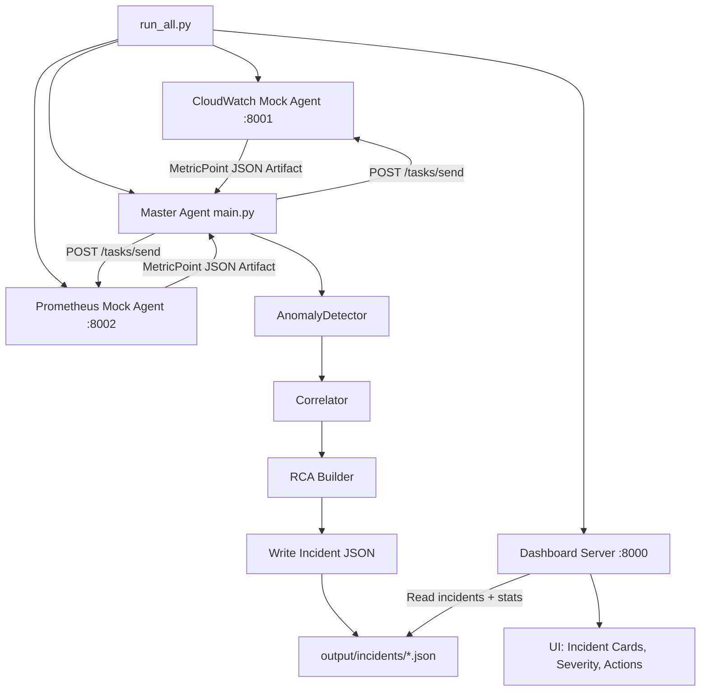

# Monitor-Agent Working Document

## 1. Current architecture
### A2A communication
- Master agent calls each sub-agent via POST `/tasks/send`.
- Sub-agents return serialized `MetricPoint` arrays in A2A artifacts.
- Master deserializes points, then runs detector -> correlator -> RCA -> incident write.

### Workflow diagram

### Components
- Dashboard server: `dashboard/server.py`
- CloudWatch mock agent: `agents/cloudwatch_agent/server.py`
- Prometheus mock agent: `agents/prometheus_agent/server.py`
- Master A2A connector/client: `agents/master_agent/a2a_connector.py`, `agents/master_agent/a2a_client.py`
- Main polling loop: `main.py`

## 2. Data produced
Incident files are written to:
- `output/incidents/<incident_id>.json`

Each incident contains:
- id, created_at, summary, root_cause, confidence, actions
- anomalies[] with source, service, metric, value, baseline_mean, zscore, severity, timestamp

## 3. Dashboard behavior
- Reads all incident JSON files from `output/incidents/`.
- Aggregates stats:
  - total incidents
  - critical anomaly count
  - warning anomaly count
  - affected services count
- Auto-refreshes every 15 seconds.

## 4. Mock anomaly model
- Mock agents generate deterministic time-bucketed data.
- Shared bucket logic is used so cross-source spikes can align in time.
- This improves correlation quality for demo/testing.

## 5. Daily workflow
1. Start stack with `python run_all.py`.
2. Keep dashboard open at http://localhost:8000.
3. Watch incident cards and expand for RCA/action details.
4. Inspect latest incident file in `output/incidents/` when needed.
5. Stop all processes with `Ctrl+C`.

## 6. Operational checks
Before demos/tests:
1. Ports 8000/8001/8002 are free.
2. Dashboard health endpoint returns ok.
3. Both sub-agent health endpoints return ok.
4. Master logs show successful fetch and poll cycles.

## 7. Next improvements (backlog)
- Add UI filters by source/service/severity.
- Add trend chart by hour/day.
- Add open-incident dedup logic across poll cycles.
- Persist detector baseline state.
- Add alert delivery (Slack/PagerDuty/webhook).
